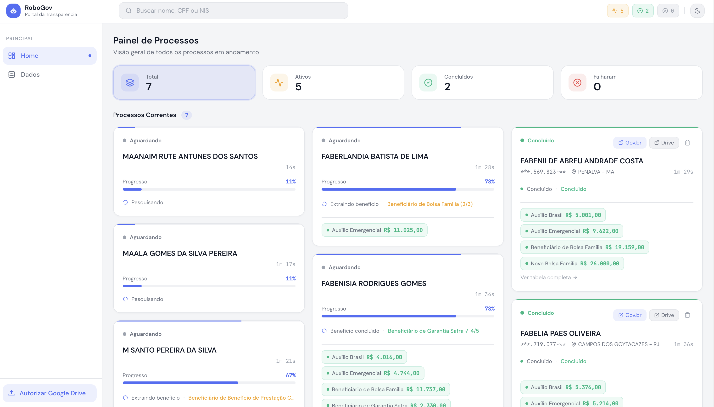
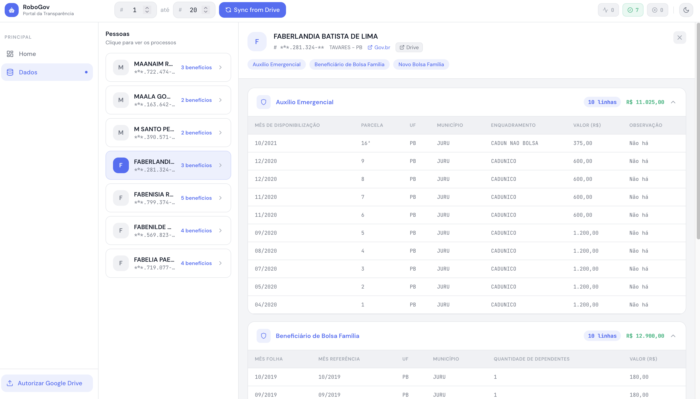

# RoboGov

Consulta automatizada de benefícios sociais no Portal da Transparência do Governo Federal.

## Pré-requisitos

- Python 3.11+ com [uv](https://docs.astral.sh/uv/getting-started/installation/)
- Node.js 18+
- Google Chrome instalado

## Configuração

Copie o arquivo de exemplo e preencha com seus dados:

```bash
cp backend/.env.example backend/.env
```

## Instalação e Execução

```bash
# Backend
cd backend
bash scripts/setup.sh
bash scripts/run.sh

# Frontend
cd frontend
npm install
npm run dev
```

Acesse `http://localhost:5173`

## Google Drive

O projeto usa OAuth2 para salvar os resultados no Google Drive de cada usuário.

O arquivo `client_secret.json` já está incluído no repositório — ele identifica o app no Google, não a sua conta pessoal.

Ao usar pela primeira vez, acesse `http://localhost:8000/api/v1/auth/google` no browser. Uma janela abrirá pedindo autorização. Após confirmar, um `token.json` é salvo localmente em `backend/app/services/google/credentials/` — **esse arquivo é pessoal e não deve ser commitado**.

<p align="center">
  &nbsp;&nbsp;
  
</p>